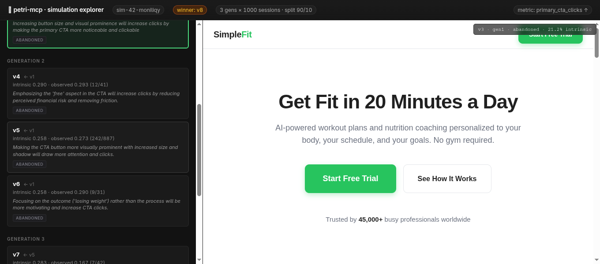
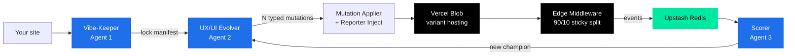

<div align="center">
  

  <h1>petri-mcp</h1>

  <p><strong>Your website, evolved.</strong><br/>
  An MCP server that A/B-tests, scores, and rewrites your site in a closed loop — until users actually convert.</p>

  <p>
    <a href="https://petri-mcp.vercel.app"></a>
  </p>

  <p>
    <a href="https://petri-mcp.vercel.app/api/mcp"></a>
    
    
    
    
    
  </p>

  <p>
    <a href="https://petri-mcp.vercel.app">Live site</a> ·
    <a href="#quickstart">Quickstart</a> ·
    <a href="#how-it-works">How it works</a> ·
    <a href="#mcp-tools">Tools</a> ·
    <a href="#configuration">Configuration</a> ·
    <a href="#roadmap">Roadmap</a>
  </p>

  <br/>
  
  <p><sub><i>The simulation explorer: every generation, every variant, every win — with the rendered HTML one click away.</i></sub></p>
</div>

---

## Why petri-mcp

v0 makes beautiful first drafts. petri-mcp makes them **perform**.

- **Locks what makes the brand the brand.** A vibe-keeper agent reads your site and freezes the logo, palette, key phrases, fonts, and voice. Variants are *invalid by construction* if they touch a locked element — caught by a deterministic validator, not a second LLM.
- **Mutates everything else.** A UX/UI evolver agent generates small, typed mutations (six kinds, from `text_content` to `css_variable`) targeted at the metric *you* name in plain English: `primary_cta_clicks`, `scroll_to_pricing`, `time_on_demo`, anything.
- **Splits real traffic 90/10.** Vercel Edge Middleware buckets visitors with a sticky cookie, sends 90% to the reigning champion, 10% to challengers. A scorer agent reads the events back, picks the winner, promotes it, and seeds the next generation.

One MCP install. The site keeps improving.

---

## Quickstart

### 1. Plug it into your MCP client

```jsonc
// claude_desktop_config.json (or any MCP client config)
{
  "mcpServers": {
    "petri": {
      "url": "https://petri-mcp.vercel.app/api/mcp"
    }
  }
}
```

That's it. Seven tools are now available to your agent.

### 2. See it work end-to-end (no setup)

Call `simulate_evolution` against any public GitHub repo. petri runs the full closed loop in-memory — vibe → evolve → split → score → promote — across N generations of synthetic 90/10 traffic, then renders a phylogenetic tree you can click through.

```jsonc
{
  "name": "simulate_evolution",
  "arguments": {
    "repoUrl": "https://github.com/your/site",
    "targetMetric": "primary_cta_clicks",
    "generations": 3,
    "sessionsPerGen": 1000,
    "nVariants": 3,
    "seed": 42
  }
}
```

You get back a `simId`. Open `https://petri-mcp.vercel.app/sim/<simId>` to see the tree.

### 3. Or run a real split

`start_split` publishes a champion + variants to Vercel Blob and registers a sticky-bucketed split:

```bash
# First request — middleware sets the cookie.
curl -i https://petri-mcp.vercel.app/p/<runId>/

# Replay with a fixed cookie — same variant every time.
curl -b "petri_variant=v1" https://petri-mcp.vercel.app/p/<runId>/
```

Every response carries `x-petri-variant` and `x-petri-run` headers so you always know which bucket served the request.

---

## How it works



Three LLM agents, one closed loop, deterministic plumbing in between.

<details>
<summary><strong>The lock contract</strong> — why variants can't break the brand</summary>

The vibe-keeper's output isn't prose — it's a flat array of `{ selector, reason, scope, property }` tuples. The evolver self-screens against the lock through a `lock_check` tool call mid-loop, and a deterministic mechanical validator catches anything that slips through on the way out.

Invalid by construction, not invalid by another LLM judging the variant.
</details>

<details>
<summary><strong>Six typed mutation kinds</strong> — why we don't free-form HTML</summary>

`text_content`, `attribute`, `add_node`, `remove_node`, `css_property`, `css_variable`. Each carries a target selector and a reason. A free-text "describe a small variant" output would have made lock-overlap detection an LLM-vs-LLM problem; the typed shape makes it a tuple lookup.
</details>

<details>
<summary><strong>Sticky bucketing</strong> — why the same user sees the same variant</summary>

A 30-day, path-scoped `petri_variant` cookie is set at the edge on the first hit. Same visitor → same variant on every subsequent visit, until the generation closes or the champion changes. Without sticky bucketing, you measure noise.
</details>

<details>
<summary><strong>Champion lock-in</strong> — explore less, exploit more</summary>

When a champion survives 3 generations in a row, the gap between new generations widens by `2^(n−3)`. The system stops poking at a winner once it's clearly winning, and reallocates compute toward sites still climbing.
</details>

---

## MCP tools

| Tool | Description |
|---|---|
| **`vibe_identifier`** | Run the vibe-keeper. Returns a JSON lock manifest with confidence + evidence per finding. |
| **`ux_ui_evolver`** | Generate N lock-respecting variants for a target metric. Returns typed mutations. |
| **`start_split`** | Publish a champion + variants to Vercel Blob, register a sticky-bucket 90/10 split, return the public URL. |
| **`read_metrics`** | Pull aggregated session events for a run from Upstash Redis. |
| **`score_generation`** | Score the current generation's variants; return per-variant scores and the proposed champion. |
| **`evolve_next_generation`** | Closed-loop step: score → promote → evolve → republish, in one call. |
| **`simulate_evolution`** | One-call showcase. Runs the full loop in-memory against synthetic traffic. Returns a phylogenetic tree. |

Both `vibe_identifier` and `ux_ui_evolver` accept either a local `projectRoot` or a public `repoUrl` (with optional `repoRef`). Public GitHub repos are shallow-cloned into `/tmp/petri-cache/` and reused on subsequent calls.

---

## Configuration

| Variable | Required | Purpose |
|---|---|---|
| `OPENROUTER_API_KEY` | yes | Powers all three agents |
| `PETRI_MODEL` | no | Defaults to `moonshotai/kimi-k2-0905`. Any OpenRouter chat model works. |
| `BLOB_READ_WRITE_TOKEN` | for splits | Vercel Blob — variant hosting. Auto-injected by the Marketplace integration. |
| `KV_REST_API_URL` + `KV_REST_API_TOKEN` | for splits | Upstash Redis — run state. Auto-injected by the Marketplace integration. |
| `PETRI_TRANSPORT` | no | Set to `http` to run the Streamable HTTP transport locally instead of stdio. |

Locally, `UPSTASH_REDIS_REST_URL` + `UPSTASH_REDIS_REST_TOKEN` are also accepted.

---

## Local development

```bash
git clone https://github.com/BecerraIgnacio/petri-MCP
cd petri-MCP
npm install
cp .env.example .env  # fill in OPENROUTER_API_KEY (+ Blob/Redis if testing splits)

npm run dev          # stdio transport — Claude Desktop, MCP Inspector
npm run dev:http     # Streamable HTTP transport — mirrors the Vercel Function shape
npm run build        # tsc + asset copy → dist/
npm start            # production stdio
npm test             # 85+ vitest tests
npm run typecheck    # strict tsc, no emit
```

**Smoke harnesses.** `npm run smoke:split -- --url <host>` exercises the 90/10 split end-to-end. `npm run smoke:events` round-trips the telemetry reporter.

---

## Project structure

```
repo/
├── api/mcp.ts                     ← Vercel Node Function entry (Streamable HTTP)
├── middleware.ts                  ← Edge middleware: sticky 90/10 bucketing
├── src/
│   ├── server.ts                  ← MCP server + 7 tool registrations
│   ├── agents/
│   │   ├── vibe-identifier/       ← Agent 1: lock manifest
│   │   ├── ux-ui-evolver/         ← Agent 2: typed-mutation generator
│   │   └── scorer/                ← Agent 3: metric interpreter
│   ├── shared/
│   │   ├── apply-mutations.ts     ← cheerio + targeted CSS regex applier
│   │   ├── inject-reporter.ts     ← telemetry snippet auto-injection
│   │   ├── start-split.ts         ← publish + register a 90/10 split
│   │   ├── score-generation.ts    ← score one generation
│   │   ├── evolve-next.ts         ← full closed-loop generation step
│   │   ├── simulate-evolution.ts  ← in-memory phylogenetic simulator
│   │   ├── render-lineage-html.ts ← static phylogenetic explorer
│   │   └── sources/               ← FileSource (Local + GitHub)
│   ├── runtime/                   ← browser-side telemetry reporter
│   └── transports/                ← stdio + HTTP wiring
├── test/                          ← 17 vitest files, 85+ tests
├── demo/sim-seed42/               ← Reference simulation, committed
└── docs/                          ← Agent specs, architecture notes
```

---

## Stack

Built on **TypeScript** (strict), **`@modelcontextprotocol/sdk` v1**, **OpenRouter** (default `moonshotai/kimi-k2-0905`), **Vercel Functions** + **Edge Middleware**, **Vercel Blob**, and **Upstash Redis**. HTML mutations through **`cheerio`** + targeted CSS regex. Validation through **`zod`**. Tests through **`vitest`**.

---

## Roadmap

- [x] **MCP server** — stdio + Streamable HTTP, 7 tools
- [x] **Hosted endpoint** — `petri-mcp.vercel.app`, public, no auth (hackathon build)
- [x] **GitHub repos as input** — public, shallow-cloned, sandboxed
- [x] **90/10 sticky-bucketed traffic split** — Vercel Blob + Edge Middleware
- [x] **Telemetry reporter + event store** — auto-injected, Upstash Redis
- [x] **Closed evolutionary loop** — score → promote → evolve → republish
- [x] **`simulate_evolution`** — judge-clickable showcase, no deploy gate
- [ ] **Vercel Marketplace listing** — auth-free install for v0/Vercel users
- [ ] **Private-repo authentication** — PAT plumbing already in the constructor
- [ ] **Multi-metric scoring** — weighted composites instead of single-metric
- [ ] **Thompson sampling** — for the 10% challenger split (currently uniform)
- [ ] **`2^(n−3)` backoff scheduler** — designed, not yet enforced as cron
- [ ] **Native phylogenetic dashboard** — the static explorer is v0.5

---

## Acknowledgements

Built for the [Vercel Agent Hackathon](https://vercel.com/blog/ai-accelerator). Powered by **Vercel** (Functions, Edge Middleware, Blob), **Upstash**, **OpenRouter**, and the **Model Context Protocol**.

---

<div align="center">
  <sub>Made by <a href="https://github.com/BecerraIgnacio">@BecerraIgnacio</a> · MIT License</sub>
</div>
